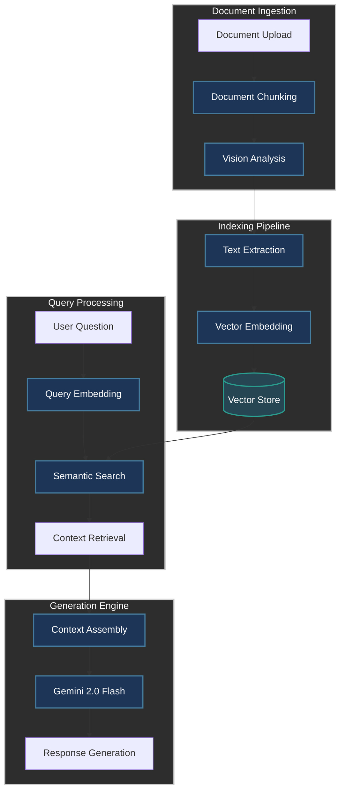

## Project Overview

In my role as a Business System Analyst, I frequently encounter organizations struggling to extract valuable insights from their document repositories. Traditional search methods often fall short when handling complex, domain-specific questions about document content. 

In this blog post, I'll share how I built a powerful document question-answering system using **Retrieval-Augmented Generation (RAG)** with Google's Gemini 2.0 Flash model.
My solution combines computer vision, natural language processing, and semantic search to create a seamless experience for users seeking information from PDF documents. By leveraging the latest advancements in multimodal AI, I've created a system that can:
- Extract text and visual elements from PDF documents
- Generate comprehensive embeddings for semantic retrieval
- Find the most relevant content for specific queries
- Produce accurate, contextually relevant answers


## System Architecture

My application follows a four-stage pipeline architecture:
1. **Document Ingestion**: Processing uploaded PDFs and preparing them for analysis
2. **Indexing Pipeline**: Extracting and encoding document content
3. **Query Processing**: Understanding user questions and finding relevant content
4. **Generation Engine**: Creating comprehensive, accurate responses



## 1. **Document Ingestion**

The document ingestion process begins when a user uploads a PDF file through the Streamlit interface. This initial stage handles the conversion of PDFs into a format suitable for AI analysis.

```python
def process_pdf(self, pdf_path: str):
    if not os.path.exists(pdf_path):
        raise FileNotFoundError(f"PDF file does not exist: {pdf_path}")
    
    Images = PDFProcessor.pdf_to_images(pdf_path, Config.DPI)
    
    page_analyses = []
    st.write("Analyzing PDF pages...")
    for i, image in enumerate(tqdm(Images)):
        analysis = self._analyze_image(image)
        if analysis:
            page_analyses.append(analysis)
```

Firstly each PDF page is converted into a high-resolution image using PyMuPDF (fitz). This approach preserves the visual fidelity of the document, which is crucial for extracting information from complex layouts, tables, and figures that typical text extraction might miss.

```python
@staticmethod
def pdf_to_images(pdf_path: str, dpi: int) -> List[Image.Image]:
    pdf_document = fitz.open(pdf_path)
    images = []
    for page_number in range(pdf_document.page_count):
        page = pdf_document[page_number]
        pix = page.get_pixmap(matrix = fitz.Matrix(dpi / 72, dpi / 72))
        image = Image.open(io.BytesIO(pix.tobytes("png")))
        images.append(image)
    pdf_document.close()
    return images
```

Setting an appropriate DPI (dots per inch) value ensures that sufficient detail for the vision model is captured to analyze it effectively.

## 2. **Indexing Pipeline**

Once the document images are ready, the indexing pipeline takes over to transform these visuals into structured, searchable data.

### Vision Analysis

The heart of the indexing system relies on Gemini 2.0 Flash's multimodal capabilities to analyze each page image:

```python
def analyze_page(self, image: Image.Image) -> str:
    prompt = """Analyze this document image and:
            1. Extract all visible text
            2. Describe any tables, their structure and content
            3. Explain any graphs or figures
            4. Note any important formatting or layout details
            Provide a clear, detailed description that captures all key information."""
    
    return self.generate_content(
        model=Config.MODEL_NAME,
        contents=[prompt, image]
    ).text
```

This approach offers significant advantages over traditional OCR:
- **Comprehensive text extraction**: Captures text regardless of formatting or layout
- **Table understanding**: Interprets tabular data with its structure preserved
- **Figure analysis**: Explains charts, graphs, and other visual elements
- **Layout awareness**: Maintains the contextual relationship between document elements

### Vector Embedding Generation

After extracting textual representations, vector embeddings are generated for each page using Google's text-embedding-004 model:

```python
embeddings = []
try:
    for text in tqdm(self.data_df['Analysis']):
        embed_result = self.gemini_client.embed_content(
            model=Config.TEXT_EMBEDDING_MODEL_ID,
            contents=[text],
            config=types.EmbedContentConfig(task_type="RETRIEVAL_DOCUMENT")
        )
        if embed_result and embed_result.embeddings:
            embeddings.append(embed_result.embeddings[0].values)
```

These embeddings transform text into high-dimensional vectors that capture semantic meaning, enabling the system to find content based on conceptual similarity rather than just keyword matching.

## 3. **Query Processing**

When a user asks a question, the system processes it through a similar pipeline to match it with the most relevant document sections.

### Query Embedding

First, the user's question is converted into the same vector space as our document embeddings:

```python
query_response = self.embed_content(
    model=Config.TEXT_EMBEDDING_MODEL_ID,
    contents=[query],
    config=types.EmbedContentConfig(task_type="RETRIEVAL_QUERY")
)

query_embedding = np.array(query_response.embeddings[0].values)
```

The **task_type** parameter is specifically set to "RETRIEVAL_QUERY" for questions, as opposed to "RETRIEVAL_DOCUMENT" for content embeddings. This distinction optimizes the embeddings for their respective roles in the retrieval process.

### Semantic Search

Once the query embedding is ready, the semantic search is performed by calculating the similarity between the query and all document pages:

```python
similarities = [
    np.dot(query_embedding, np.array(page_embedding))
    for page_embedding in df['Embeddings']
]

best_idx = np.argmax(similarities)
```

This simple dot product operation identifies the most semantically relevant content for the user's question.

## 4. **Generation Engine**

With the relevant context identified, the final stage is to generate a comprehensive answer.

### Context Assembly

The following prompt is provided that includes both the user's question and the retrieved context:

```python
def make_answer_prompt(self, query: str, passage: dict) -> str:
    escaped = passage['content'].replace("'", "").replace("\n", " ")
    return textwrap.dedent(f"""
        You are a helpful assistant analyzing research papers.
        Use the provided passage to answer the question.
        Be comprehensive but explain technical concepts clearly.
        If the passage is irrelevant, say so.

        QUESTION: '{query}'
        PASSAGE: '{escaped}'

        ANSWER:
    """)
```

This structured prompt ensures the model focuses on the specific question while having access to the most relevant document content.

### Response Generation

Finally, the system uses Gemini 2.0 Flash to generate the answer:

```python
response = self.gemini_client.generate_content(
    model = Config.MODEL_NAME,
    contents = [prompt]
)
```

The output provides a comprehensive answer based on the document context, along with citation information pointing to the specific page where the information was found.

### Rate Limiting and Error Handling

To ensure stable operation, I've implemented rate limiting using the Python ratelimit library:

```python
@sleep_and_retry
@limits(calls=1, period=1)
def create_embeddings(self, data: str):
    time.sleep(1)
    return self.client.models.embed_content(
        model = Config.TEXT_EMBEDDING_MODEL_ID,
        contents = data,
        config = type.EmbedContentConfig(task_type = "RETRIEVAL_DOCUMENT")
    )
```

Additionally, the source code includes robust error handling throughout the pipeline to gracefully manage issues like empty responses, API failures, or processing errors.

## The Streamlit Interface

I've built a clean, user-friendly interface using Streamlit that allows users to:
- Upload PDF documents
- Ask questions about the document content
- Receive answers with source citations

```python
def main():
    load_dotenv()
    st.set_page_config(page_title="RAG AI Application", page_icon="📚", layout="wide")
    st.title("Ask the RAG AI Application")

    # Application setup and form handling
    with st.form(key = "my_form"):
        pdf_file = st.file_uploader("Upload a PDF file", type = ['pdf'])
        questions = st.text_input("Enter your question:", placeholder = "Please provide a short summary")
        submit_button = st.form_submit_button(label = "Submit")
```

## Key Benefits and Applications

My RAG-based document QA system offers numerous advantages over traditional search methods:
- **Comprehensive understanding**: Captures both textual and visual elements from documents
- **Semantic search**: Finds information based on meaning, not just keywords
- **Contextual answers**: Provides responses that directly address the user's question
- **Source transparency**: Cites the specific document sections used to generate answers

I've found the system is particularly valuable for:
- Research organizations: Quickly extract insights from scientific papers and reports
- Legal firms: Find relevant information across large collections of legal documents
- Healthcare: Access and interpret medical literature and patient records
- Financial services: Analyze reports, prospectuses, and regulatory filings

## Future Enhancements
While my current implementation provides impressive capabilities, I'm considering several potential enhancements that could further improve the system:
- **Fine-tuning**: Adapting the models to specific domains or document types
- **Chunking optimization**: Experimenting with different chunking strategies
- **Multi-document support**: Extending the system to search across document repositories
- **Streaming responses**: Implementing real-time answer generation
- **User feedback integration**: Learning from user interactions to improve relevance

## Conclusion

My RAG-based document QA system represents a significant advancement in how organizations can interact with their document repositories. By combining the power of multimodal AI with semantic search and generative models, I've created a tool that transforms how information is extracted from PDFs.
The system demonstrates the potential of modern AI to solve real-world information access challenges, making document content more accessible and actionable than ever before.