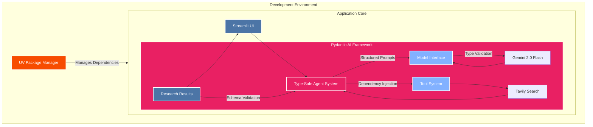

## Project Overview

The AI News Research Agent is an intelligent system that automates news research and synthesis using modern AI technologies. It combines Google's Gemini 2.0 Flash model with Tavily's search capabilities in a type-safe framework powered by Pydantic-AI.


## System Architecture




## Key Features

1. **Type-Safe Architecture**
   - Built with Pydantic-AI for robust type checking
   - Structured data validation throughout the pipeline
   - Clear interface definitions for all components

2. **Advanced LLM Integration**
   - Uses Google's Gemini 2.0 Flash model
   - Efficient prompt management
   - Structured output generation

3. **Real-Time Search**
   - Integration with Tavily Search API
   - Configurable search parameters
   - Asynchronous operation

4. **User-Friendly Interface**
   - Built with Streamlit
   - Interactive parameter adjustment
   - Clear result presentation

## Technical Implementation

### Core Components

1. **Type Definitions**

```python
class ResearchResult(BaseModel):
    research_title: str = Field(description='Markdown heading describing the article topic')
    research_main: str = Field(description='A detailed news article')
    research_bullets: str = Field(description='Key points summary')

@dataclass
class SearchDataclass:
    max_results: int
    todays_date: str
```

2. **Agent Configuration**

```python
search_agent = Agent(
    model,
    deps_type=ResearchDependencies,
    result_type=ResearchResult,
    system_prompt=(
        "You are a helpful research assistant and an expert in research. "
        "Given a single user query, you will call the 'get_search' tool exactly once, "
        "then combine the results."
    )
)
```

3. **Search Tool Integration**

```python
@search_agent.tool
async def get_search(search_data: RunContext[SearchDataclass], query: str) -> dict:
    """Perform a search using the Tavily client."""
    results = await tavily_client.get_search_context(
        query=query,
        max_results=search_data.deps.max_results
    )
    return json.loads(results)
```


### Technical Implementation details

1. **Dependency Injection**
   - Clean separation of concerns
   - Easily testable components
   - Flexible configuration

2. **Async Operations**
   - Non-blocking search operations
   - Efficient resource utilization
   - Improved response times

3. **Type Safety**
   - Runtime type checking
   - Clear interface definitions
   - Reduced potential for errors

4. **Structured Output**
   - Consistent response format
   - Validated data structures
   - Easy integration with frontend

## Use Cases

1. **News Research**
   - Quick synthesis of current events
   - Multi-source information gathering
   - Automated summarization

2. **Topic Analysis**
   - Deep dives into specific subjects
   - Cross-reference multiple sources
   - Structured insights generation

3. **Trend Monitoring**
   - Track emerging topics
   - Analyze developing stories
   - Identify key patterns

## Future Development

1. **Enhanced Search**
   - Multiple search provider support
   - Advanced filtering options
   - Custom search parameters

2. **Improved Processing**
   - Advanced content synthesis
   - Better source verification
   - Enhanced summarization

3. **UI Enhancements**
   - More interactive features
   - Custom visualization options
   - Advanced result filtering

## Source Code

The complete source code is available on GitHub:
[AI LLM Tutorials Repository](https://github.com/sabit-shaiholla/ai-llm-tutorials/tree/master)

## Technical Stack

- **Frontend**: Streamlit
- **AI Model**: Google Gemini 2.0 Flash
- **Search**: Tavily API
- **Framework**: Pydantic-AI
- **Language**: Python 3.9+

## Conclusion

The AI News Research Agent demonstrates the practical application of modern AI technologies in creating useful tools for information gathering and synthesis. Its type-safe architecture ensures reliability while providing powerful capabilities for automated news research.

The project serves as an example of how to combine different AI services into a cohesive, production-ready application while maintaining code quality and type safety.