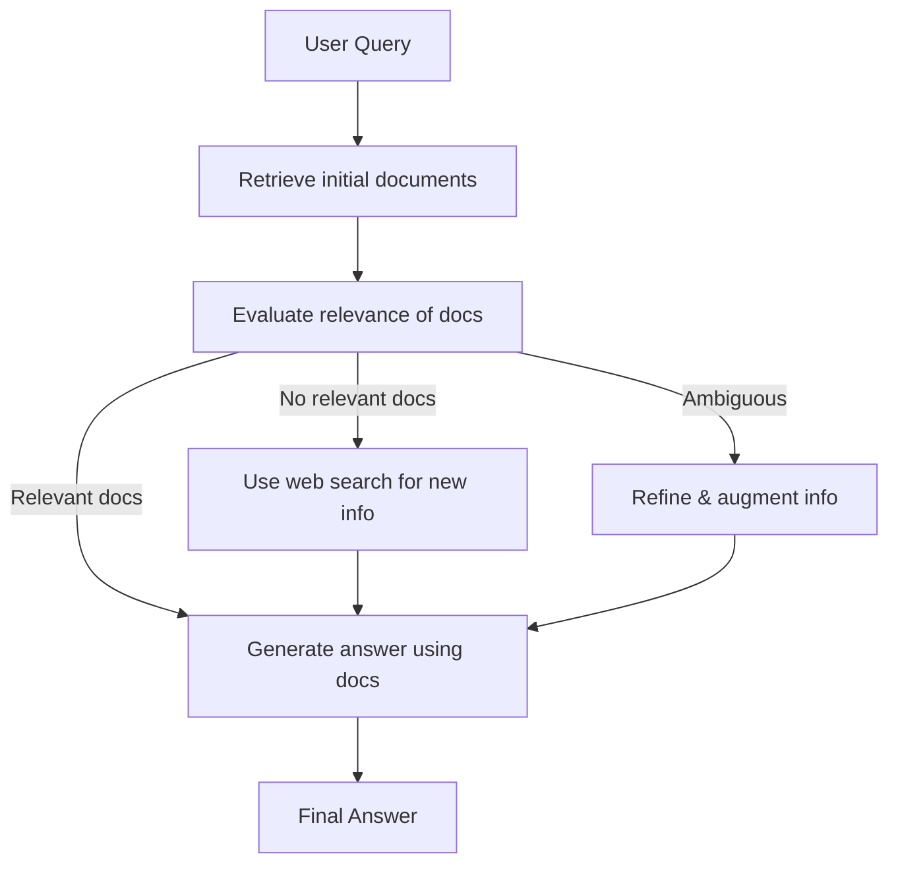

Large Language Models (LLMs) have demonstrated impressive capabilities, but they are not always reliable. Anyone who’s used AI chatbots has likely encountered confident yet incorrect answers – what researchers often call hallucinations. These are responses that sound plausible but are factually wrong. Such behavior poses a major challenge when deploying LLM-based agents in real-world scenarios where accuracy matters. How can we trust AI assistants if they might fabricate information?

One promising approach to curb LLM unreliability is `Retrieval-Augmented Generation (RAG)`. RAG grounds an LLM’s responses in external knowledge: when asked a question, the system first retrieves relevant documents (from a database or the web) and supplies them to the LLM as context. This way, the model isn’t relying solely on its internal (potentially outdated or fuzzy) knowledge, but can base its answer on up-to-date, factual sources. RAG has quickly become a go-to pattern for improving answer accuracy. In fact, Gartner now considers RAG a key design strategy for making LLM responses more precise in enterprise AI applications.

RAG helps, but it’s not foolproof. If the retrieval step fetches irrelevant or incorrect documents, the LLM’s answer will still be wrong, just with an illusion of support. In other words, garbage in, garbage out: an LLM will confidently use whatever context it’s given – and if that context is off-target, the result can mislead. Traditional RAG pipelines typically don’t double-check the retrieved info; they simply feed it to the model and trust it blindly. This is where new strategies come in to inject a layer of verification and correction into the process.

## From RAG to Corrective RAG: Self-Checking Retrieval for Accuracy

One such strategy is `Corrective Retrieval-Augmented Generation (CRAG)`, often shortened to `Corrective RAG`. This advanced technique builds upon RAG by adding an in-the-loop evaluation step – essentially having the system grade its own retrieved documents before producing the final answer. You can think of it as the LLM agent pausing to ask: “Have I actually found the information I need to answer the question?” If the retrieval results are inadequate, the agent can take corrective action (like searching again elsewhere) instead of proceeding with flawed or incomplete context.

In the original CRAG proposal (Yan et al., 2024), a lightweight model is used as a retrieval evaluator to assess how relevant the fetched documents are to the query. Based on this assessment, the pipeline can branch into different actions:
* ✅ `Relevant (High Confidence)`: If at least one retrieved document is clearly relevant and likely contains the answer, proceed as normal. The agent may even perform a knowledge refinement step – extracting and focusing on the most pertinent facts from those documents – before answering.
* ❌ `Irrelevant (Low Confidence)`: If none of the retrieved docs seem useful (e.g. all scores fall below a low threshold), assume the retrieval failed. In this case, discard those results and try a different approach – for example, run a new web search to find better information.
* 🤔 `Ambiguous (Medium Confidence)`: If the evaluation is mixed – say some content is partially relevant but not fully sufficient – take a hybrid approach. The agent can refine the initial docs (filter out noise, extract key points) and simultaneously perform an expanded search to gather additional context. The refined and new information are then combined for answer generation.

This extra reflection step makes the system much more robust. Instead of blindly trusting the first retrieval, the agent actively validates and “corrects” its knowledge sources. It won’t just run with potentially irrelevant data. If the retrieved evidence is lacking, CRAG teaches the agent to recognize that and to course-correct – for instance, by searching the web for fresh info rather than risking an inaccurate answer. This approach directly targets the common failure mode of standard RAG, where a model can get led astray by bad context.

To illustrate, consider the flowchart below, which outlines how a Corrective RAG agent handles a user query with a self-checking retrieval process:

In a Corrective RAG pipeline, the agent evaluates the retrieved documents before answering. If the initial documents are irrelevant, it performs a new search. If they are partially relevant, it refines them and augments with additional info. Only once sufficient relevant knowledge is secured does the agent generate the answer. This self-reflective loop dramatically reduces the chance of the agent basing its answer on faulty premises.

Crucially, CRAG doesn’t require training a gigantic new model or altering the base LLM – it’s more of an architectural pattern or workflow. The retrieval evaluator can be a relatively small model or heuristic. In practice, this means the overhead of the evaluation step is modest, especially compared to the cost of using a large LLM for the answer generation itself. The original research found that adding this reflection step significantly boosted answer accuracy across multiple tasks, outperforming both standard RAG and even a more complex iterative approach called Self-RAG. In other words, a little bit of checking goes a long way. By filtering out irrelevant info and always grounding the answer in confidently relevant knowledge, the agent produces `more correct, focused responses`.

Of course, no method is without trade-offs. Corrective RAG’s extra steps do introduce some latency and complexity into the system. The agent might call an evaluator model and possibly issue a second search query, which can slow down responses. There’s also more moving parts (retriever, evaluator, etc.) to maintain. In settings where speed is paramount or resources are limited, developers need to balance this overhead against the benefit of improved reliability. That said, when accuracy is critical, the slight delay is often a worthy price for avoiding a wrong or hallucinated answer.

## Bringing in OpenEvals: LLMs That Judge Themselves

So how do we implement such self-checking behavior in practice? This project combines the idea of Corrective RAG with OpenEvals, an open-source toolkit for evaluating LLM outputs. OpenEvals (recently released by the LangChain team) provides ready-made LLM-as-a-judge modules – essentially prompt templates and interfaces that let one LLM critique or score another model’s output. Think of it as a unit-testing framework for AI: much like software tests validate parts of a program, OpenEvals uses language models to validate parts of an AI agent’s behavior. OpenEvals comes with a suite of evaluation prompts for common criteria in LLM applications. For example, it includes built-in evaluators for:
* `Correctness` – Does the model’s answer match a known correct answer (ground truth)?
* `Helpfulness` – Does the answer address the user’s question effectively and fully?
* `Groundedness` – Is the answer grounded in the provided context documents (or is it introducing unsupported facts)?
* `Retrieval Relevance` – Are the retrieved documents actually relevant to the query?

In my reliability-focused agent, I used several of these evaluators in the loop as reflection mechanisms. The retrieval relevance check is especially key: after the agent retrieves candidate documents via a search tool, it immediately invokes an OpenEvals prompt to judge how well each document answers the user’s question. If a document is deemed irrelevant or off-topic, it can filter it out before it ever reaches the generation stage. This automatic triage of retrieval results means the LLM only sees what’s likely to help answer correctly, keeping out the “distractors” that could lead it astray.

For instance, suppose the user asks: `“Where was the first president of FoobarLand born?”` and our initial search turned up a few documents about FoobarLand (a fictional country) but none actually mention the president’s birthplace. The OpenEvals retrieval relevance evaluator would catch this mismatch. It might return a result indicating `score: False`, with a comment along these lines: *“None of the documents specify where the first president was born... the crucial information is missing. Thus, the retrieved context does not fully address the question.”*. Armed with that feedback, the agent realizes its current context is insufficient to answer the question. Instead of guessing or making something up, it can dynamically trigger a broader search – for example, querying an online encyclopedia or database for the president’s bio. This is the Corrective RAG behavior in action: using the evaluator’s critique to decide the next step (a new retrieval) rather than producing an unreliable answer.

Agent also leverage OpenEvals to evaluate the final answer before presenting it to the user. As a reflection step, the agent generates an initial answer draft then asks an evaluator: “Is this answer actually helpful and grounded in the provided info?” If the answer did not fully address the query or included unsupported claims, the evaluator’s feedback will reflect that. The agent can then take that as a cue to refine its answer – for example, performing another targeted search for missing details, or adjusting the answer to remove unverifiable statements. This kind of corrective prompting (the agent iteratively prompting itself to improve the answer) further boosts reliability. It ensures the answer is both complete and source-backed, not just superficially plausible.

In summary, OpenEvals allows the LLM agent to judge its own intermediate outputs just like a human reviewer might: *“Did I find the right info? Did I answer the question well?”* By baking these evaluators into the agent’s decision flow, we create a feedback loop where the LLM can catch and fix its mistakes. It’s a bit meta – an AI that introspects on its own work – but extremely powerful for reducing errors.

## Building the Agent: LangGraph, LLMs, and Tools

### Source code can be found here: [Github - Corrective RAG OpenEvals](https://github.com/sabit-shaiholla/corrective-rag-openevals)

Implementing a Corrective RAG agent with OpenEvals involved assembling a few moving pieces. At a high level, the agent is orchestrated as a graph of actions:
* `LLM Backbone`: The core reasoning and answer generation is done by an LLM. For flexibility and cost-efficiency, I experimented with a smaller local model (Qwen-2.5, a 7B parameter model) running via the Ollama engine, as well as a larger cloud model (Google’s Gemini 2.5) for comparison. The agent code can work with any LLM that LangChain/LangGraph supports – you just plug in the model API or runtime of choice. The local Qwen model is fast for prototyping, while Gemini (a state-of-the-art model) offers higher quality outputs.
* `Web Retrieval Tool`: To give the agent up-to-date knowledge, I integrated a web search capability. This uses the Tavily Search API as a tool the agent can call. Whenever the agent needs fresh information (e.g. to answer a query or to find supporting facts), it issues a search query via Tavily and gets back top relevant snippets from the web. These snippets are then treated as candidate context documents.
* `LangGraph Orchestration`: Rather than coding the entire decision logic from scratch, I took advantage of LangGraph, a framework for defining AI agent workflows as a graph of nodes. Each node can be an LLM call, a tool invocation, or a conditional logic step. LangGraph allowed me to declaratively specify the sequence: *Search the web → Evaluate results → If not sufficient, search again → Generate answer → Evaluate answer*. This made the complex flow easier to manage and tweak. Under the hood, LangGraph coordinates the calls to the LLM (for generation and for the OpenEvals “judge” prompts) and the search tool, passing the outputs along the chain.
* `OpenEvals Evaluators`: As described, the OpenEvals library is used to create the evaluator nodes in the graph. For example, one node uses the retrieval relevance prompt to score the search results, and another node uses a `helpfulness/groundedness` prompt to review the answer draft. These nodes output scores or boolean flags and explanations, which the agent logic uses to decide branches (e.g. if *retrieval_relevance == False*, go down the “retry search” branch).

All these components together form the Corrective RAG agent. The agent’s behavior feels much more ***intentional and intelligent*** than a standard single-pass LLM. It actively seeks out the answer, verifies that its sources are useful, and isn’t afraid to loop back to searching if it realizes something important is missing. In practice, this means if you ask our agent a question, you’re more likely to get an answer that’s factually correct and well-supported by evidence, or a polite admission that it needs more information – rather than a hallucinated guess.

## Results: More Reliable Answers (and Fewer Hallucinations)

By combining retrieval augmentation, self-evaluation, and iterative refinement, we significantly improved the reliability and correctness of the LLM agent’s responses. Some key outcomes and observations:
* **`Fewer Incorrect Answers`**: The agent’s answers are grounded in checked information, so it’s far less prone to factual mistakes. In benchmark evaluations, approaches like CRAG have outperformed naive RAG baselines, demonstrating higher answer accuracy across both short-form Q&A and long-form tasks. In my tests, the agent would often catch that it didn’t have enough info to answer a tricky question and automatically go find the needed detail, rather than just winging it.
* **`Reduced Hallucination`**: The groundedness enforcement means the model sticks to the retrieved facts. If the model tries to introduce something not supported by the documents, the evaluator flags it, prompting the agent to verify or remove it. This feedback loop cuts down on hallucinated content. The final answers are more trustworthy because you can trace their origin to real sources, not the model’s imagination.
* **`Robustness to Retrieval Failure`**: Even if the first retrieval attempt misses the mark, the agent can recover. This resilience was a big advantage in experiments – when the initial search was poor, the corrective strategy ensured the overall performance didn’t drop as sharply as it would for a normal RAG system. In one scenario, the agent’s primary data source lacked an answer, but a web search via the CRAG logic found the needed info in a web search. The ability to *fail gracefully* and try alternatives is a hallmark of this approach.
* **`Focused and Concise Responses`**: By filtering out irrelevant context, the agent has a more focused knowledge base to work with. I noticed the answers tended to be more concise and on-point. The model isn’t distracted by unrelated text in the prompt, which also reduces the chance of it going off on tangents. Essentially, the self-checks act as a quality filter on the context fed to the LLM.
* **`Moderate Overhead, Clear Gains`**: Using these techniques does add some overhead – an extra API call here, a small model run there – but in our experience the impact on latency was acceptable. The retrieval evaluation uses a lightweight prompt (or smaller model) that is fast to execute. For many questions, the agent only needs one cycle of search and answer. The slight increase in response time is well justified by the boost in confidence one can have in the answer. When building AI solutions that might be used in business or critical domains, that confidence is priceless.

## Conclusion

In conclusion, this project demonstrates that with the right strategies, we *can* tame the unpredictability of LLM agents. By fusing Corrective RAG’s self-reflective retrieval process with OpenEvals’ easy-to-use evaluators, we equip the AI with a compass and a map – it can check its direction and course-correct to stay on the path of truth. This approach turns the agent from a probabilistic matter into a more *`dependable problem-solver`* that knows when to say, “I need to double-check that.”

As LLMs continue to evolve, such reliability enhancements will be crucial. It’s exciting to see these techniques move from research papers into practical tools that developers can apply in their own applications. The ability for an AI agent to critique itself and iteratively improve is a powerful concept, and we’re just scratching the surface. With open-source frameworks like OpenEvals lowering the barrier, we can expect a new generation of AI agents that are not only smart but also correct – agents that earn our trust one accurate answer at a time.

## References
1. [Gartner Research - Key Skills to Build LLMs With Retrieval-Augmented Generation](https://www.gartner.com/en/documents/5354963)
2. [Zhen et al., 2023, Judging LLM-as-a-Judge with MT-Bench and Chatbot Arena](https://arxiv.org/pdf/2306.05685)
3. [Yan et el., 2024, Corrective Retrieval Augmented Generation](https://arxiv.org/pdf/2401.15884)
4. [OpenEvals by LangChain](https://github.com/langchain-ai/openevals)