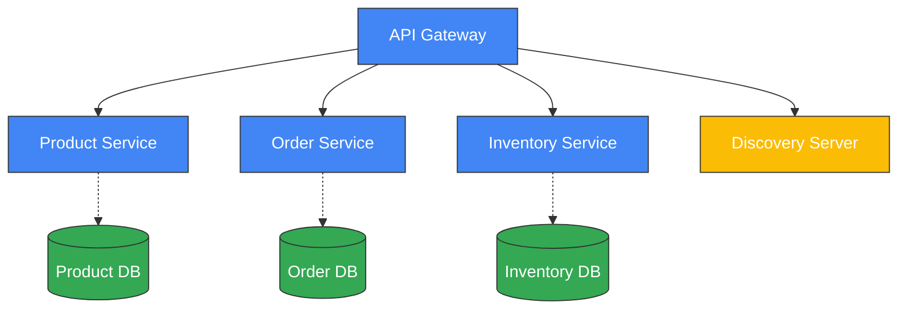

# Building a Scalable E-Commerce Platform with Docker Compose and Spring Microservices

## Project Overview

This project demonstrates my implementation of a scalable e-commerce platform using microservices architecture. The solution addresses key challenges in modern e-commerce applications including modular development, independent deployability, and service isolation while maintaining a cohesive system.


## Source Code

The complete source code is available on GitHub:
[E-Commerce Microservices Repository](https://github.com/sabit-shaiholla/ecommerce-microservices)

## Core Technologies

The platform is built using the following technologies:

- **Java Spring Boot**: For microservice implementation
- **Spring Cloud Gateway**: For API gateway functionality
- **Spring Data JPA**: For data access layer
- **Spring Security**: For authentication and authorization
- **MySQL**: For persistent data storage
- **Docker & Docker Compose**: For containerization and service orchestration
- **Zipkin**: For distributed tracing
- **Eureka**: For service discovery
- **Swagger/OpenAPI**: For API documentation

## Microservices Architecture Implementation

### Service Composition

The e-commerce platform is composed of the following microservices:



Each service has a specific business function:

1. **Product Service**: Manages product catalog and information
2. **Order Service**: Handles order creation and processing
3. **Inventory Service**: Manages product stock levels
4. **API Gateway**: Routes client requests to appropriate services
5. **Discovery Server**: Provides service registration and discovery

### API Gateway Implementation

The API Gateway serves as the single entry point for all clients, implemented using Spring Cloud Gateway:

- **Routing**: Routes requests to the appropriate microservices based on path
- **Load Balancing**: Client-side load balancing for distributed instances
- **Integration with Discovery Service**: Dynamic service resolution

```yaml
spring:
  cloud:
    gateway:
      routes:
        - id: product-service
          uri: lb://product-service
          predicates:
            - Path=/api/product/**
        - id: order-service
          uri: lb://order-service
          predicates:
            - Path=/api/order/**
        - id: inventory-service
          uri: lb://inventory-service
          predicates:
            - Path=/api/inventory/**
```

### Service Discovery with Eureka

The project uses Netflix Eureka for service discovery, allowing services to find and communicate with each other without hardcoded URLs:

- **Service Registration**: Each microservice registers itself with Eureka
- **Service Discovery**: Services locate each other through the Eureka server
- **Health Monitoring**: Automatic detection of service health

This implementation allows for dynamic scaling and replacement of service instances without configuration changes.

### Inter-Service Communication

The project implements two communication patterns:

1. **Synchronous Communication (REST)** 
   - Used for immediate responses and direct service-to-service calls
   - Example: Checking inventory availability during order placement

2. **WebClient Integration**
   - Non-blocking HTTP requests between services
   - Example: Order service communicating with inventory service

```java
// Example of WebClient usage in Order Service
private final WebClient.Builder webClientBuilder;

public OrderService(WebClient.Builder webClientBuilder) {
    this.webClientBuilder = webClientBuilder;
}

private Boolean checkInventory(String skuCode) {
    return webClientBuilder.build().get()
        .uri("http://inventory-service/api/inventory/" + skuCode)
        .retrieve()
        .bodyToMono(Boolean.class)
        .block();
}
```

### Data Management Strategy

Each microservice has its own dedicated database:

- **Product Service Database**: Stores product information
- **Order Service Database**: Manages order data
- **Inventory Service Database**: Tracks product inventory levels

This approach provides:
- **Decoupling**: Changes to one service's data model don't affect others
- **Independent Scaling**: Database resources can be allocated according to service needs
- **Technology Independence**: Each service can use the database technology best suited to its requirements

### Containerization with Docker Compose

The entire application is containerized using Docker with Docker Compose for orchestration:

```yaml
# Excerpt from docker-compose.yml
version: '3'
services:
  ## MySQL Database
  mysql:
    container_name: mysql
    image: mysql:8.0
    environment:
      - MYSQL_ROOT_PASSWORD=mysql
      - MYSQL_DATABASE=order-service
    ports:
      - "3306:3306"
    volumes:
      - ./mysql:/var/lib/mysql
    healthcheck:
      test: "/usr/bin/mysql --user=root --password=mysql --execute \"SHOW DATABASES;\""
      interval: 2s
      timeout: 20s
      retries: 10

  ## Zipkin
  zipkin:
    image: openzipkin/zipkin
    container_name: zipkin
    ports:
      - "9411:9411"

  ## Eureka Server
  discovery-server:
    image: ${DOCKER_USERNAME}/discovery-server:latest
    container_name: discovery-server
    pull_policy: always
    ports:
      - "8761:8761"
    environment:
      - SPRING_PROFILES_ACTIVE=docker
    depends_on:
      - zipkin

  ## API Gateway
  api-gateway:
    image: ${DOCKER_USERNAME}/api-gateway:latest
    container_name: api-gateway
    pull_policy: always
    ports:
      - "8181:8080"
    environment:
      - SPRING_PROFILES_ACTIVE=docker
      - LOGGING_LEVEL_ORG_SPRINGFRAMEWORK_SECURITY=TRACE
    depends_on:
      - zipkin
      - discovery-server

  ## Product Service
  product-service:
    container_name: product-service
    image: ${DOCKER_USERNAME}/product-service:latest
    pull_policy: always
    environment:
      - SPRING_PROFILES_ACTIVE=docker
    depends_on:
      - mongo
      - discovery-server
      - api-gateway

  ## Order Service
  order-service:
    container_name: order-service
    image: ${DOCKER_USERNAME}/order-service:latest
    pull_policy: always
    environment:
      - SPRING_PROFILES_ACTIVE=docker
    depends_on:
      mysql:
        condition: service_healthy
      discovery-server:
        condition: service_started
      api-gateway:
        condition: service_started

  ## Inventory Service
  inventory-service:
    container_name: inventory-service
    image: ${DOCKER_USERNAME}/inventory-service:latest
    pull_policy: always
    environment:
      - SPRING_PROFILES_ACTIVE=docker
    depends_on:
      mysql:
        condition: service_healthy
      discovery-server:
        condition: service_started
      api-gateway:
        condition: service_started
```

Benefits of using Docker Compose:
- **Infrastructure as Code**: Environment defined in version-controlled files
- **Consistency**: Identical environments across development and production
- **Simplified Deployment**: One command to start the entire system
- **Dependency Management**: Proper service startup order and health checks

### Distributed Tracing

The project implements distributed tracing with Zipkin:

- **Request Tracking**: Trace requests as they travel through multiple services
- **Performance Monitoring**: Identify bottlenecks and latency issues
- **Error Analysis**: Track where failures occur in the request chain

This provides valuable insights for debugging and performance optimization in a distributed environment.

## Implementation Details by Service

### Product Service

The Product Service manages the product catalog, implemented with:

- **REST API** for CRUD operations on products
- **MongoDB** for flexible document storage
- **Spring Data MongoDB** for data access abstraction

Key features:
- Product creation and retrieval
- Product information management
- Catalog organization

### Order Service

The Order Service handles order processing with:

- **Transaction Management**: Ensuring order consistency
- **Integration with Inventory**: Checking stock availability before order placement
- **MySQL Database**: Relational storage for order data
- **Order Event Generation**: Creating events upon order placement

### Inventory Service

The Inventory Service manages product stock levels:

- **Stock Verification API**: Checking if products are in stock
- **Inventory Updates**: Adjusting stock levels as products are ordered
- **MySQL Database**: Tracking inventory quantities

### CI/CD Pipeline

A key part of the project is the automated build and deployment process:

- **GitHub Actions**: Automated workflows for testing and building
- **Docker Hub Integration**: Publishing container images
- **Automated Testing**: Running tests before deployment

## Challenges and Solutions

### Challenge 1: Service Discovery in a Containerized Environment

**Solution**: Implemented Eureka service discovery with Docker-specific configuration to handle network isolation.

### Challenge 2: Database Initialization and Migration

**Solution**: Used Flyway for database schema migration, ensuring consistent database initialization across environments.

### Challenge 3: Inter-Service Communication Reliability

**Solution**: Implemented proper error handling and circuit breakers for service-to-service communications to prevent cascading failures.

### Challenge 4: Container Orchestration

**Solution**: Created a well-structured Docker Compose file with health checks and dependency management to ensure proper service startup order.

## Lessons Learned

Building this microservices-based e-commerce platform provided valuable insights:

1. **Service Boundaries**: Defining clear service boundaries based on business capabilities is crucial
2. **Configuration Management**: Externalizing configuration for different environments simplifies deployment
3. **Docker Compose Benefits**: Docker Compose provides a good balance of simplicity and power for small to medium microservices deployments
4. **Observability Importance**: Implementing proper logging and tracing from the start saves significant debugging time
5. **Start Small**: Begin with core services and expand gradually rather than attempting to build everything at once

## Conclusion

This e-commerce microservices project demonstrates a practical implementation of microservices architecture using Spring Boot and Docker Compose. The approach provides modularity, independent deployability, and technology diversity while maintaining system cohesion through well-defined interfaces and service discovery.

The Docker Compose orchestration offers a lightweight yet powerful way to manage multiple services without the complexity of full Kubernetes orchestration, making it ideal for small to medium-sized projects or as a stepping stone toward more complex deployments.

The resulting platform provides a solid foundation for an e-commerce business with the flexibility to evolve individual components independently while maintaining overall system integrity.