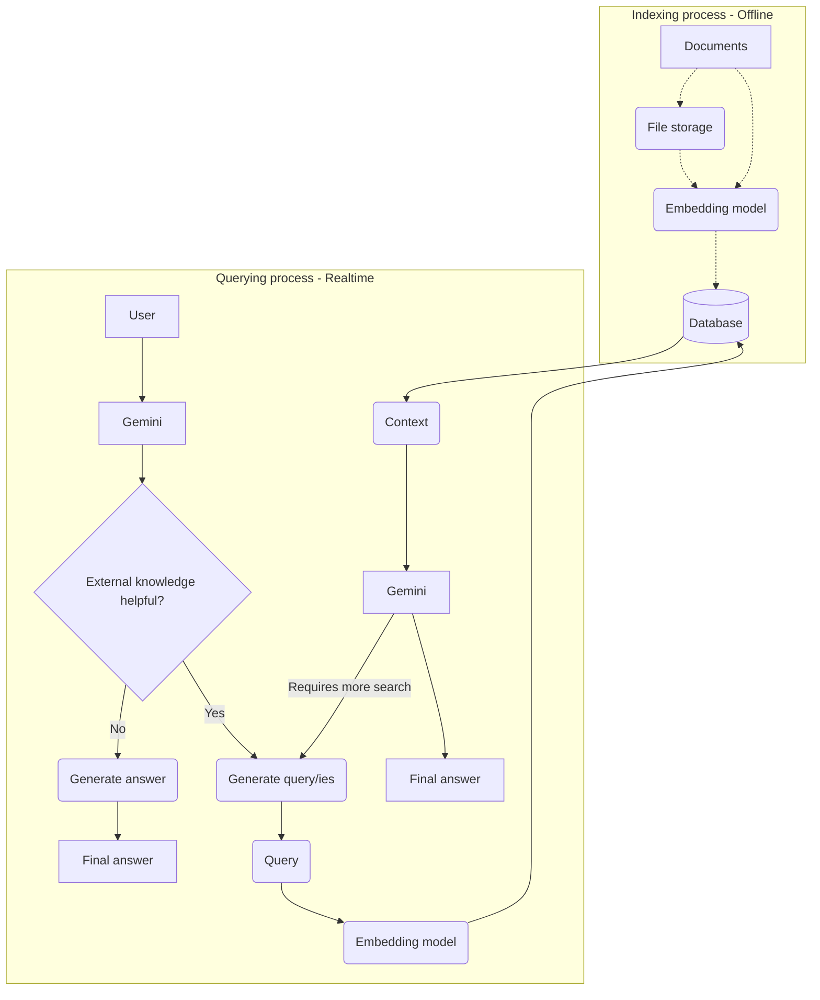

I have been closely following the advancements in the Retrieval Augmented Generation (RAG) space, and from my perspective, RAG will never be the same after the introduction of the File Search Tool in the Gemini API. This new tool is a fully managed RAG system built directly into the Gemini API, effectively serving as a scalable, integrated, and highly cost-effective RAG-as-a-Service solution

For AI engineers and developers, this is a game-changer. Previously, building a reliable RAG pipeline was an infrastructure nightmare, requiring us to choose a vector database, develop complex chunking strategies, integrate an embedding model, and glue everything together.The File Search Tool abstracts away the entire retrieval pipeline, allowing us to focus purely on building creative applications that address user challenges.

The Gemini API enables RAG through the File Search tool by automatically handling the underlying complexities. It simplifies the process of grounding Gemini with your proprietary data to deliver responses that are more accurate, relevant, and verifiable. 

## **Source Code and Service in Action**

The complete source code is available on GitHub:
[Gemini API File Search Tool - RAG-as-a-Service](https://github.com/sabit-shaiholla/gemini-api-file-search-tool)

To experience the File Search Tool processing documents (like PDF files) and generating grounded answers directly, you can access the deployed service below:
Deployed Service (on Oracle Cloud): [https://filequerysystem.duckdns.org/](https://filequerysystem.duckdns.org/)

## **File Search: The Managed Solution**

### **How It Works: Semantic Search and Managed Indexing**

The core power of File Search lies in its use of semantic search. Unlike traditional keyword-based searches, semantic search understands the deeper meaning and context of your query.

When you import a file, the system automatically breaks it down into chunks, embeds it using a powerful embedding model (such as gemini-embedding-001), and indexes it. These numerical representations, called embeddings, capture the semantic meaning of the text and are stored in a specialized File Search database. When a user submits a prompt, that query is also converted into an embedding, and the system performs a vector search to find the most similar and relevant document chunks from your store.

This entire process is consolidated into a simple workflow:
1. Create a File Search store: This store is the persistent container for your processed data and embeddings
2. Upload and Import: You upload files, either by using the uploadToFileSearchStore API or separately using the Files API and then importFile. The data is chunked, converted into File Search embeddings, and indexed
3. Query with File Search: You pass the FileSearch tool, referencing your store name, to the generateContent method. The model performs the semantic search and uses the retrieved context to ground its response.

The following diagram illustrates the indexing and querying process internally:



The dotted line path (Documents straight to the Embedding model) represents the uploadToFileSearchStore API, which bypasses the File Storage step during indexing

### **Key Advantages: Cost, Flexibility, and Trust**

#### **Unbeatable Pricing Model**

The pricing structure for File Search addresses one of the biggest bottlenecks in managed RAG solutions:
* Storage is absolutely free of charge.
* Query time embeddings are free of charge.
* You only pay for embeddings at **initial indexing time** ($0.15 per 1 million tokens, based on the embedding model used, which is typically gemini-embedding-001).
* Retrieved document tokens are charged as regular context tokens.

This billing approach makes the File Search Tool both significantly easier and very cost-effective to build and scale with.

#### **Flexibility and Management**

The concept of a persistent File Search store is crucial. While raw files uploaded through the Files API are typically deleted after 48 hours, the indexed data in a File Search store is stored indefinitely until you choose to delete it.

A particularly neat feature is the ability to progressively add and remove files from an existing knowledge base. This simplifies maintaining and updating your corpus over time.

For fine-grained control, you can apply **custom metadata** (key-value pairs) to files during import. This allows you to use a ```metadata_filter``` when querying the model, enabling searches only within a specific subset of documents within a large store. You can also specify a ```chunking_config``` setting to define a maximum number of tokens per chunk and maximum number of overlapping tokens if you need more control over the chunking strategy.

#### **Built-in Verification**

One of the most important aspects for business use is **built-in citations (autocitation)**. The model’s responses automatically include grounding metadata that specifies exactly which parts of your uploaded documents were used to generate the answer. This greatly simplifies the verification and fact-checking process, helping to prevent hallucination.

### **Limitations and Considerations**

While the File Search tool simplifies RAG immensely, there are a few considerations:
* **File Size Limits**: The maximum size limit per document is 100 MB.
* **Store Size Limits**: The total size of a project's File Search stores ranges based on your user tier, from 1 GB (Free Tier) up to 1 TB (Tier 3). For optimal retrieval latencies, it is recommended to keep each individual store under 20 GB.
* **Chunk Control**: Currently, there is limited ability to adjust the number of chunks retrieved during a query.
* **Supported Models**: File Search is supported by gemini-2.5-pro and gemini-2.5-flash.
* **Supported Formats**: The tool supports a wide array of file formats, including PDF, DOCX, JSON, various text types (e.g., Markdown, HTML), and common application file types.

Despite some limitations, the File Search tool eliminates the need for complex setup and management work, democratizing RAG for businesses and organizations.