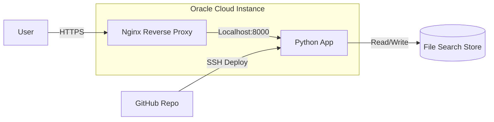

In this post, I will share the detailed steps I took to set up the infrastructure for my [Gemini API File Search Tool](https://github.com/sabit-shaiholla/gemini-api-file-search-tool). I chose Oracle Cloud's Always Free Tier because it offers generous resources that are perfect for hosting small to medium-sized projects without incurring costs.

For more details about Gemini File Search Tool, you can check my other blog post [Revolutionizing RAG: Why Gemini File Search Tool is the great RAG-as-a-Service](/portfolio/gemini-file-search-tool).

### **Architecture Overview**

Here is a high-level view of how the components interact:



This setup ensures a robust, secure, and cost-effective environment for hosting the Gemini API File Search Tool.

## **1. Oracle Cloud Infrastructure Setup**

### **Account and Instance Creation**
First, I created an account on [Oracle Cloud](https://www.oracle.com/cloud/free/) to access their Always Free services. Once logged in, I proceeded to set up the networking and compute instance.

1.  **VCN Creation**: I used the VCN Wizard to create a Virtual Cloud Network (VCN) with Internet connectivity. This automatically set up the necessary subnets, gateways, and route tables.
2.  **Instance Configuration**:
    *   **Image**: Ubuntu 22.04
    *   **Shape**: VM.Standard.E2.1.Micro (This shape provides 2 vCPUs and 1GB RAM, which is eligible for the Always Free tier).
3.  **SSH Keys**: I generated a new SSH key pair and saved the private key to connect to the instance later.

### **Security Rules**
To allow traffic to reach the server, I configured the Ingress Rules in the Default Security List associated with my public subnet:

*   **SSH**: Allow TCP port 22 (for remote access).
*   **HTTP**: Allow TCP port 80 from `0.0.0.0/0` (Anywhere).
*   **HTTPS**: Allow TCP port 443 from `0.0.0.0/0` (Anywhere).

Once the instance was running, I connected to it via SSH:

```bash
ssh -i /path/to/private.key ubuntu@<YOUR_INSTANCE_PUBLIC_IP>
```

> [!TIP]
> For a more detailed walkthrough on creating your first Linux instance, refer to the official [Oracle Documentation](https://docs.oracle.com/en-us/iaas/Content/Compute/tutorials/first-linux-instance/overview.htm).

---

## **2. Server Configuration**

After logging in, I updated the package list and installed the essential tools and dependencies required for the project.

```bash
sudo apt update
sudo apt install -y python3 python3-venv python3-pip git
```

### **Application Setup**
I cloned the project repository and set up a Python virtual environment to isolate the dependencies.

```bash
cd /home/ubuntu
git clone https://github.com/sabit-shaiholla/gemini-api-file-search-tool.git
cd gemini-api-file-search-tool

# Create and activate virtual environment
python3 -m venv .venv
source .venv/bin/activate

# Install Python dependencies
pip install --upgrade pip
pip install -r requirements.txt
```

---

## **3. Domain and DNS Configuration**

To make the application accessible via a friendly URL, I used [DuckDNS](https://www.duckdns.org/), a free dynamic DNS service.

1.  I created a domain: `filequerysystem.duckdns.org`.
2.  I pointed it to the Public IP address of my Oracle Cloud instance.
3.  To ensure the IP address stays updated (in case it changes), I set up a cron script.

**DuckDNS Update Script:**

```bash
mkdir -p ~/duckdns
echo 'echo url="https://www.duckdns.org/update?domains=filequerysystem&token=<YOUR_TOKEN>&ip=" | curl -k -o ~/duckdns/duck.log -K -' > ~/duckdns/duck.sh
chmod 700 ~/duckdns/duck.sh
```

I then added this script to my crontab to run every 5 minutes:

```bash
*/5 * * * * ~/duckdns/duck.sh >/dev/null 2>&1
```

---

## **4. Nginx and Firewall Setup**

I used Nginx as a reverse proxy to handle incoming HTTP/HTTPS requests and forward them to the Python application.

### **Install Nginx and Configure Firewall**

```bash
sudo apt install -y nginx

# Allow HTTP and HTTPS traffic through iptables
sudo iptables -I INPUT -p tcp --dport 80 -j ACCEPT
sudo iptables -I INPUT -p tcp --dport 443 -j ACCEPT
sudo netfilter-persistent save
```

### **Nginx Configuration**
I created a new configuration file for the site at `/etc/nginx/sites-available/filequerysystem`.

```nginx
server {
    server_name filequerysystem.duckdns.org;

    # Increase client body size for file uploads
    client_max_body_size 200M;

    location / {
        proxy_pass http://127.0.0.1:8080; # Forward to the app running on port 8080
        proxy_http_version 1.1;

        # WebSocket support (important for Streamlit)
        proxy_set_header Upgrade $http_upgrade;
        proxy_set_header Connection "upgrade";

        # Standard proxy headers
        proxy_set_header Host $host;
        proxy_set_header X-Real-IP $remote_addr;
        proxy_set_header X-Forwarded-For $proxy_add_x_forwarded_for;
        proxy_set_header X-Forwarded-Proto $scheme;

        # Timeouts for long-running requests
        proxy_read_timeout 86400;
        proxy_connect_timeout 86400;
        proxy_send_timeout 86400;
    }
}
```

I enabled the site by creating a symlink:

```bash
sudo ln -s /etc/nginx/sites-available/filequerysystem /etc/nginx/sites-enabled/
sudo nginx -t # Test configuration
sudo systemctl restart nginx
```

---

## **5. SSL Certificate with Let's Encrypt**

Security is paramount, so I secured the application with an SSL certificate using Certbot.

```bash
sudo apt install -y certbot python3-certbot-nginx
sudo certbot --nginx -d filequerysystem.duckdns.org
```

Certbot automatically modified the Nginx configuration to force HTTPS and set up auto-renewal.

---

## **6. Application Service**

To ensure the application runs continuously and restarts on failure, I created a systemd service file.

**File:** `/etc/systemd/system/filequerysystem.service`

```ini
[Unit]
Description=Gemini API File Search Tool
After=network.target

[Service]
User=ubuntu
Group=ubuntu
WorkingDirectory=/home/ubuntu/gemini-api-file-search-tool
Environment="PATH=/home/ubuntu/gemini-api-file-search-tool/.venv/bin"
ExecStart=/home/ubuntu/gemini-api-file-search-tool/.venv/bin/python app.py
Restart=always

[Install]
WantedBy=multi-user.target
```

Then, I enabled and started the service:

```bash
sudo systemctl daemon-reload
sudo systemctl enable filequerysystem
sudo systemctl start filequerysystem
```

---

## **7. Automated Deployment**

To streamline updates, I configured a GitHub Actions workflow. This workflow automatically deploys changes to the server whenever code is pushed to the `master` branch.

**Workflow File:** `.github/workflows/deploy.yml`

You can check the whole file [here](https://github.com/sabit-shaiholla/gemini-api-file-search-tool/blob/master/.github/workflows/deploy.yml).

```yaml
name: Deploy to Oracle Cloud

on:
  push:
    branches: [ master ]

jobs:
  deploy:
    runs-on: ubuntu-latest
    steps:
    - uses: actions/checkout@v2
    
    - name: Deploy to Server
      uses: appleboy/ssh-action@master
      with:
        host: ${{ secrets.HOST }}
        username: ${{ secrets.USERNAME }}
        key: ${{ secrets.SSH_KEY }}
        script: |
          cd /home/ubuntu/gemini-api-file-search-tool
          git pull origin master
          source .venv/bin/activate
          pip install -r requirements.txt
          sudo systemctl restart filequerysystem
```
