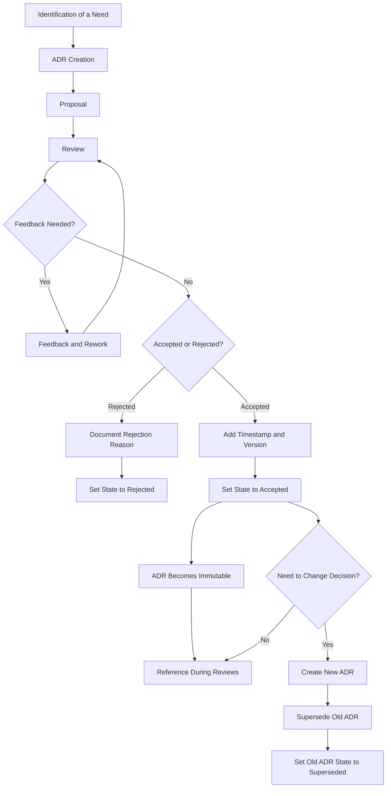

### Problem statement
In the dynamic world of software development, teams constantly make choices that shape the architecture of their projects. However, the rationale behind these crucial decisions can often get lost over time, leading to confusion for new team members, repeated mistakes, and difficulty in evolving the system effectively.

ADRs are concise documents that log the context, decisions, and consequences of significant architectural choices, serving as a valuable record of a project's design history.

At its core, an ADR is a document that captures a specific **architectural decision**, the **context** surrounding that decision, and its resulting **consequences**. These records follow a **lifecycle** and have different states. The collection of these ADRs forms a **decision log**, which provides valuable project context, including detailed design and implementation information. Team members can quickly grasp the project's direction by skimming the headlines or delve into specific design choices by reading individual ADRs. Once an ADR is accepted, it becomes **immutable**; if a change is needed, a new ADR is created to supersede the old one.

### What exactly is an ADR?

An ADR is a record of a specific architectural decision made by the team. Each ADR should clearly outline:

*   **The Problem or Question:** The issue or requirement that necessitated the decision.
*   **The Context:** The current situation, including any relevant background information and constraints. This often includes exploring **alternatives** and their pros and cons.
*   **The Decision:** The specific architectural choice that was made.
*   **The Rationale (Why):** The reasoning behind choosing this particular solution, focusing on *why* this decision was made rather than *how* it was implemented.
*   **The Consequences:** The positive and negative effects of implementing the decision, including potential risks and trade-offs.
*   **The Status:** The current state of the decision (e.g., Proposed, Accepted, Rejected, Superseded).

Ultimately, an ADR serves as a **"diary of architectural decisions"** for a project.

### Why are ADRs Important?

ADRs address a common problem in software development: **the loss of architectural knowledge**. Over time, the reasons behind certain design choices can become unclear, especially to new team members or even the original developers revisiting the code later. Without a documented history, teams risk:

*   **Losing the context** of past decisions.
*   **Repeating mistakes** that were already considered and avoided.
*   **Decreasing efficiency** by spending time figuring out the rationale behind existing solutions.

By documenting architectural decisions, ADRs act as a **repository of collective memory**. This brings several key benefits:

*   **Faster onboarding for new team members:** They can quickly understand the project's evolution and key architectural choices.
*   **Avoidance of repeated discussions:** The reasoning behind a decision is readily available, preventing the team from rehashing the same topics.
*   **Improved transparency and alignment:** Everyone on the team understands why and how decisions were made, fostering a shared understanding.
*   **Better quality decisions:** The process of documenting forces a more thorough consideration of the decision and its implications.
*   **Easier ownership handover:** When responsibilities for systems change, the new owners can quickly get up to speed by reviewing the relevant ADRs.
*   **Facilitating alignment across teams:** If multiple teams are working on related projects, ADRs can help them align on best practices and avoid duplicated efforts.

### What constitutes an Architecturally Significant Decision?

Not every small decision needs an ADR. The focus should be on **architecturally significant decisions** that significantly affect the software project or product. These can include choices related to:

*   **Structure:** Architectural patterns like microservices.
*   **Non-functional requirements:** Security, high availability, and fault tolerance.
*   **Dependencies:** Coupling between different components.
*   **Interfaces:** APIs and published contracts.
*   **Construction techniques:** Libraries, frameworks, tools, and development processes.

Essentially, if a decision is **costly to change** later, it's likely architecturally significant. While implementation details like the specific UI platform or SQL database choice are important, the decision *to use* a certain type of UI or database architecture would be more likely to warrant an ADR. The key is the **impact** and the **cost of reversal**.

### The Anatomy of an ADR

While specific templates can vary, a typical ADR includes the following essential components:

*   **Title (or Number/Date):** A concise name or a unique identifier (e.g., ADR-001) along with the date of the decision.
*   **Status:** The current state of the ADR (e.g., Proposed, Accepted, Rejected, Superseded).
*   **Context (Why):** A description of the problem being addressed and the surrounding circumstances that necessitate the decision. This often includes the considered alternatives, along with their pros and cons.
*   **Decision (What/How):** A clear statement of the chosen architectural solution. The focus here is on *what* the decision is, rather than the detailed *how* of implementation.
*   **Rationale (Why):** The justification for the chosen decision, explaining *why* this option was selected over the alternatives.
*   **Consequences:** A description of the potential positive and negative outcomes of the decision, including any trade-offs.
*   **Timestamp:** Recording when additions or modifications are made to the ADR, especially relevant for aspects that might change over time.
*   **Stakeholders (Optional):** Listing the individuals or teams affected by the decision.

The focus on the **reasoning behind the decision ("why")** is crucial. Understanding the "why" makes it easier for others to adopt the decision and prevents future reconsideration without proper context.

### The ADR Adoption and Review Process

The process of creating and adopting ADRs typically involves these steps:

1.  **Identification of a Need:** A team member identifies an architecturally significant decision that needs to be made.
2.  **ADR Creation:** An **ADR owner** (typically the author who is responsible for maintaining and communicating the ADR) starts writing the ADR based on a project-wide template.
3.  **Proposal:** The ADR owner submits the ADR in a **Proposed** state.
4.  **Review:** The ADR owner initiates a review process involving the project team. This often includes a dedicated reading time followed by a discussion of comments and questions.
5.  **Feedback and Rework (if needed):** If the team identifies areas for improvement, the ADR remains in the **Proposed** state, and the owner addresses the action points.
6.  **Rejection (if applicable):** The team can decide to reject the ADR, in which case the owner documents the reason for rejection and sets the state to **Rejected**.
7.  **Acceptance:** If the team approves the ADR, the owner adds a timestamp, version, and stakeholders (if applicable) and updates the state to **Accepted**. The accepted ADR becomes **immutable**.
8.  **Superseding:** If a previously accepted decision needs to change due to new insights, a new ADR is proposed and, if accepted, **supersedes** the older ADR. The state of the old ADR is then changed to **Superseded**.
9.  **Reference:** Accepted ADRs serve as a reference during code and architectural reviews to ensure that changes align with agreed-upon decisions.

Every team member can propose an ADR, but establishing clear **ownership** is important for maintenance and communication.

### When Should You Write an ADR?

An ADR should be written **whenever a decision of significant impact is made**. This includes:

*   **Proposing large changes:** Decisions that significantly affect the system's design, maintenance, or extensibility.
*   **Proposing small but important changes:** Even seemingly small decisions can have long-term implications and are worth documenting.
*   **Backfilling undocumented decisions:** If an existing practice or implicit standard isn't documented, creating an ADR can clarify it for everyone, especially new hires.

The teams at Spotify found ADRs beneficial for onboarding, ownership handover, and aligning best practices across different teams and locations.

### Practical Steps for Implementing ADRs

To effectively introduce ADRs into your project:

1.  **Define Responsible Individuals:** Assign technical leads or senior developers to be primarily responsible for authoring and maintaining ADRs.
2.  **Create a Simple Template:** Develop an easy-to-use template that covers the essential sections.
3.  **Integrate into Decision-Making:** Make ADR creation a part of the process for discussing and approving significant architectural changes.
4.  **Ensure Accessibility and Transparency:** Store ADRs in a location easily accessible to the entire team, such as the project repository or a documentation system.
5.  **Maintain Up-to-Date Documents:** Regularly review ADRs for relevance and update them or create new ones when architectural changes occur.

### Overcoming Challenges

Teams might face some resistance to adopting ADRs:

*   **Resistance to documentation:** Emphasize the benefits and start with a simple process and template. Show the team the real advantages of having a documented history.
*   **Outdated documents:** Implement a process for regular review and updates, assigning responsibility for this task.
*   **Information overload:** Focus on documenting only the most significant decisions and use a clear structure with tags or categories to make information easy to find.

By implementing ADRs thoughtfully, teams can create a valuable **decision log** that fosters better understanding, reduces duplicated effort, and supports the long-term success of their projects. Various companies like Google, Spotify, Microsoft, AWS, and Red Hat have adopted similar practices, highlighting their value in managing complex systems.

### References
1. **ADR process - AWS Prescriptive Guidance:** [https://aws.amazon.com/prescriptive-guidance/documentation/adr-process/](https://aws.amazon.com/prescriptive-guidance/documentation/adr-process/)
2. **Architectural Decision Records (ADRs) | Architectural Decision Records (GitHub):** [https://adr.github.io/](https://adr.github.io/)
3. **ADR Templates (GitHub):** [https://adr.github.io/templates/](https://adr.github.io/templates/)
4. **When Should I Write an Architecture Decision Record - Spotify Engineering:** [https://engineering.atspotify.com/2020/04/14/when-should-i-write-an-architecture-decision-record/](https://engineering.atspotify.com/2020/04/14/when-should-i-write-an-architecture-decision-record/)
5. **Why you should be using architecture decision records to document your project (Red Hat Blog):** [https://www.redhat.com/en/blog/why-you-should-be-using-architecture-decision-records-document-your-project](https://www.redhat.com/en/blog/why-you-should-be-using-architecture-decision-records-document-your-project)
6. **Architecture decision records overview (Google Cloud):** [https://cloud.google.com/architecture/architecture-decision-records](https://cloud.google.com/architecture/architecture-decision-records)